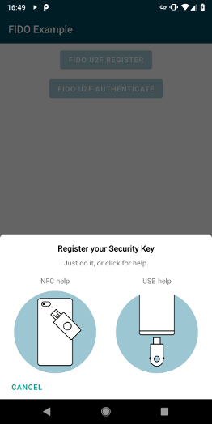
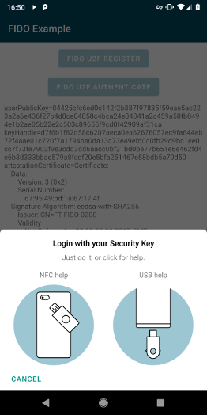

# FIDO U2F







In this guide, you'll learn how to integrate the Hardware Security SDK in your app to extend your login mechanism with two-factor authentication.
This is done by first registering a FIDO U2F Security Key in your user's profile.
Later, a login using username/password is extended using a second-factor authentication with FIDO U2F Security Keys.

Fork sample code on Github: https://github.com/cotechde/hwsecurity-samples/tree/main/fido-sample


## Add the SDK to Your Project

Add this to your ``build.gradle``:

```gradle

dependencies {
    // FIDO implementation
    implementation 'de.cotech:hwsecurity-fido:'

    // Additional classes for local parsing and verification of FIDO messages
    // Usually not required for FIDO clients.
    //implementation 'de.cotech:hwsecurity-fido-util:'
}
```

## Initialize the Hardware Security SDK

To use the SDK's functionality in your app, you need to initialize the ``SecurityKeyManager`` first.
This is the central class of the SDK, which dispatches incoming NFC and USB connections.
Perform this initialization in the ``onCreate`` method of your ``Application`` subclass.
This ensures Security Keys are reliably dispatched by your app while in the foreground.

We start by creating a new class which extends ``android.app.Application`` as follows:

```java
public class MyCustomApplication extends Application {
    @Override
    public void onCreate() {
        super.onCreate();

        SecurityKeyManager securityKeyManager = SecurityKeyManager.getInstance();
        SecurityKeyManagerConfig config = new SecurityKeyManagerConfig.Builder()
            .setEnableDebugLogging(BuildConfig.DEBUG)
            .build();
        securityKeyManager.init(this, config);
    }
}
```

Then, register your ``MyCustomApplication`` in your ``AndroidManifest.xml``:

```xml
<application 
    android:name=".MyCustomApplication"
    android:label="@string/app_name" 
... >
```


## FIDO Security Key Registration

Show our ``FidoDialogFragment`` to register a Security Key:

```java
private void showFidoRegisterDialog() {
    // Make a registration request to the server. In a real application, this would perform
    // an HTTP request. The server sends us a challenge (and some other data), that we proceed
    // to sign with our FIDO Security Key.
    String fidoAppId = "https://fido-login.example.com";
    String fidoFacetId = FidoFacetIdUtil.getFacetIdForApp(context);
    byte[] challengeBytes = new byte[] {}; // Insert 16 bytes random challenge
    String registerChallenge = WebsafeBase64.encodeToString(challengeBytes);
    FidoRegisterRequest registerRequest = FidoRegisterRequest.create(fidoAppId, fidoFacetId, registerChallenge)

    // This opens a UI fragment, which takes care of the user interaction as well as all FIDO
    // internal operations for us, and triggers a callback to #onRegisterResponse(FidoRegisterResponse).
    FidoDialogFragment fidoDialogFragment = FidoDialogFragment.newInstance(registerRequest);
    fidoDialogFragment.show(getSupportFragmentManager());
}
```

Implement ``OnFidoRegisterCallback`` in your Activity and override ``onFidoRegisterResponse`` to receive callbacks from the ``FidoDialogFragment``:

```java
@Override
public void onFidoRegisterResponse(@NonNull FidoRegisterResponse registerResponse) {
    // Forward the registration response from the FIDO Security Key to our server application.
    // The server will perform some checks, and then remember this FIDO key as a registered
    // login mechanism for this user.
}
```

## FIDO Authentication

Authentication is now done by creating a ``FidoAuthenticateRequest``:

```java
private void showFidoAuthenticateDialog() {
    // Make an authentication request to the server. In a real application, this would perform
    // an HTTP request. The server will send us a challenge based on the FIDO key we registered
    // before (see above), asking us to prove we still have the same key.
    String fidoAppId = "https://fido-login.example.com";
    String fidoFacetId = FidoFacetIdUtil.getFacetIdForApp(context);
    byte[] challengeBytes = new byte[] {}; // Insert 16 bytes random challenge
    String authChallenge = WebsafeBase64.encodeToString(challengeBytes);
    byte[] keyHandle = new byte[] {}; // Insert keyHandle from previous FidoRegisterResponse
    FidoAuthenticateRequest.create(fidoAppId, fidoFacetId, authChallenge, keyHandle);

    // This opens a UI fragment, which takes care of the user interaction as well as all FIDO internal
    // operations for us, and triggers a callback to #onAuthenticateResponse(FidoAuthenticateResponse).
    FidoDialogFragment fidoDialogFragment = FidoDialogFragment.newInstance(authenticateRequest);
    fidoDialogFragment.show(getSupportFragmentManager());
}
```

Implement ``OnFidoAuthenticateCallback`` in your Activity and override ``onFidoAuthenticateResponse``:

```java
@Override
public void onFidoAuthenticateResponse(@NonNull FidoAuthenticateResponse authenticateResponse) {
    // Forward the authentication response from the FIDO Security Key to our server application.
    // The server will check that the signature matches the FIDO key we registered with, and if
    // so we have successfully logged in.
}
```

## Prevent Re-Creation of Activity with USB Security Keys

Besides the functionalities used by our SDK, some Security Keys register themselves as USB keyboards to be able to insert One Time Passwords (OTP) when touching the golden disc.
Thus, when inserting a Security Key into the USB port, Android recognizes a new keyboard and re-creates the current activity.

To prevent this, add ``keyboard|keyboardHidden`` to the activity's ``configChanges`` in your ``AndroidManifest.xml``:

```xml
<activity
    android:name=".MyCustomActivity"
    android:configChanges="keyboard|keyboardHidden"
... >
```

## Congratulations!

That's all!
